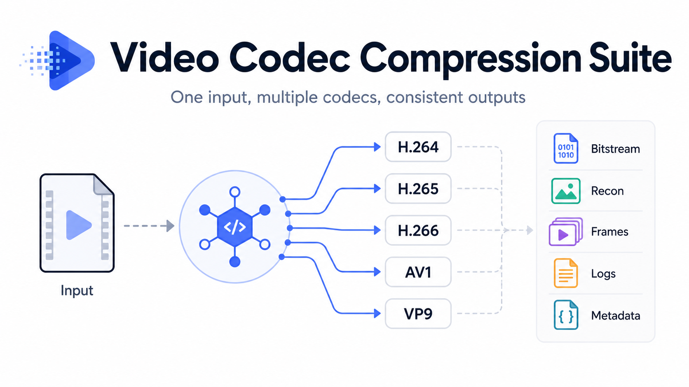

# Video Codec Compression Suite



Configurable video compression tool for running one input through multiple
codecs, QP settings, and log exporters.

## Features

- Input: video file, image sequence, or raw YUV.
- Codecs: H.264, H.265, H.266, AV1, VP9.
- Backends: FFmpeg encoders for practical compression, plus JM/HM/VTM reference
  software for standard-oriented experiments.
- Configurable preprocessing: FPS, frame count, crop/resize, pixel format,
  bit depth, and frame export.
- Source frame manifests preserve the original frame count and can preserve
  original image filenames for decoded-frame exports.
- Native encoder logs are saved by default.
- Optional HEVC/x265-style normalized CSV export for cross-codec analysis.
- Metadata records both requested QP and the actual encoder quality parameter.

AV1 and VP9 do not use H.26x QP directly. When these codecs are selected, the
tool records the mapping explicitly, for example requested `QP=37` to AV1 `q`
or VP9 `crf`.

## Install

Create the conda environment:

```bash
conda env create -f environment.yml
conda activate vccs
```

Install or refresh the local package:

```bash
pip install -e .
```

FFmpeg and FFprobe are installed through the provided conda environment.

Reference software backends require external binaries:

- JM for `h264_jm`
- HM for `h265_hm`
- VTM for `h266_vtm`

Build only the reference software you need, then set its executable and config
paths in the matching YAML file under `configs/codecs/`.

Reference software sources:

- JM / H.264: https://iphome.hhi.de/suehring/tml/download/
- HM / H.265: https://vcgit.hhi.fraunhofer.de/jct-vc/HM
- VTM / H.266: https://vcgit.hhi.fraunhofer.de/jvet/VVCSoftware_VTM

Typical build flow:

```bash
# HM or VTM
git clone <reference-repo-url>
cd <reference-repo>
mkdir build
cd build
cmake ..
make -j
```

After building, set paths such as:

```yaml
# configs/codecs/h265_hm.yaml
hm:
  encoder_path: /path/to/HM/bin/TAppEncoderStatic
  cfg_path: /path/to/HM/cfg/encoder_randomaccess_main.cfg

# configs/codecs/h266_vtm.yaml
vtm:
  encoder_path: /path/to/VVCSoftware_VTM/bin/EncoderAppStatic
  cfg_path: /path/to/VVCSoftware_VTM/cfg/encoder_randomaccess_vtm.cfg
```

## Quick Start

Prepare a YUV input first:

```bash
python -m vccs prepare-yuv \
  --input input.mp4 \
  --config configs/prepare_yuv.yaml \
  --output outputs/input_yuv
```

Then run a codec-specific compression:

```bash
python -m vccs compress \
  --input-yuv outputs/input_yuv/input/input.yuv \
  --codec-config configs/codecs/h265_ffmpeg.yaml \
  --qp 37 \
  --hmstyle-csv \
  --output outputs/h265_qp37
```

Or run several codec backends in parallel:

```bash
python -m vccs compress-suite \
  --input-yuv outputs/input_yuv/input/input.yuv \
  --qp 37 \
  --workers 2 \
  --hmstyle-csv \
  --codec-config configs/codecs/h264_ffmpeg.yaml \
  --codec-config configs/codecs/h265_ffmpeg.yaml \
  --codec-config configs/codecs/av1_ffmpeg.yaml \
  --codec-config configs/codecs/vp9_ffmpeg.yaml \
  --output outputs/q37_suite
```

After `pip install -e .`, the shorter `vccs ...` command is also available.

## Configuration

Use `configs/prepare_yuv.yaml` for input and YUV generation settings such as
FPS, frame count, crop/resize, pixel format, bit depth, and frame export.
For image-sequence inputs, preparation writes a source frame manifest. Codec
runs and decoded-frame exports should use that manifest so the output frame
count matches the input frame count. When `frame_export.preserve_source_names`
is enabled, exported decoded frames keep the original source filenames instead
of using generated names such as `000001.jpg`.

Use one codec config per compression backend:

- `configs/codecs/h264_ffmpeg.yaml`
- `configs/codecs/h264_jm.yaml`
- `configs/codecs/h265_ffmpeg.yaml`
- `configs/codecs/h265_hm.yaml`
- `configs/codecs/h266_vtm.yaml`
- `configs/codecs/av1_ffmpeg.yaml`
- `configs/codecs/vp9_ffmpeg.yaml`

Reference software paths are configured in YAML. The package does not bundle JM,
HM, or VTM. For `h264_jm`, set the JM executable and work directory:

```yaml
jm:
  encoder_path: /path/to/JM/bin/lencod.exe
  workdir: /path/to/JM/bin
```

## Parallelism

The pipeline supports two kinds of parallelism:

- Encoder-level threading: one video is encoded with multiple internal encoder
  threads when the selected encoder supports it.
- Job-level multiprocessing: multiple independent videos or scenes are processed
  at the same time.

FFmpeg-based backends expose `ffmpeg.threads` and `parallel.job_workers` in their
codec YAML files. Reference software backends such as HM and VTM default to
job-level multiprocessing because their internal parallel options are
implementation-specific and can affect reproducibility.

For a single video, tune encoder-level threading first. For a dataset with many
scenes or videos, tune `parallel.job_workers` to run multiple independent jobs.

## Outputs

Each run writes a self-contained output directory:

```text
outputs/<run_id>/
  metadata.json
  input/
    input.yuv
    source_names.txt
  bitstream/
  recon/
  frames/
  logs/
```

`metadata.json` is the main audit record. It includes input properties, selected
codec, requested QP, effective encoder quality parameter, output paths, and the
normalized CSV path when enabled.
`input/source_names.txt` is the frame manifest used to keep decoded-frame
exports aligned with the original frame count and, when enabled, the original
frame names.

Native encoder stdout/stderr logs are preserved by default. The normalized
HEVC/x265-style CSV is a compatibility export for cross-codec analysis. It uses
the same column layout across codecs. Fields available from the encoded stream,
such as frame type and packet bits, are filled when `ffprobe` can read them.
Unavailable codec-specific metrics are kept empty or filled with configured
dummy values so downstream parsers can rely on a stable schema.

Use `--hmstyle-csv` to force this CSV export on, or `--no-hmstyle-csv` to turn
it off for a run. The generated filename is `logs/<codec>_qp<QP>_hmstyle.csv`.

## References

This project wraps or interoperates with the following codec implementations.
Check the linked projects for build instructions, licensing, and codec-specific
options.

- FFmpeg: https://ffmpeg.org/
- FFmpeg source: https://git.ffmpeg.org/ffmpeg.git
- x264 / H.264 encoder: https://www.videolan.org/developers/x264.html
- x265 / H.265 encoder: https://x265.org/
- JM / H.264 reference software: https://iphome.hhi.de/suehring/tml/download/
- HM / H.265 reference software: https://vcgit.hhi.fraunhofer.de/jct-vc/HM
- VTM / H.266 reference software: https://vcgit.hhi.fraunhofer.de/jvet/VVCSoftware_VTM
- SVT-AV1: https://gitlab.com/AOMediaCodec/SVT-AV1
- libvpx / VP9: https://www.webmproject.org/code/
